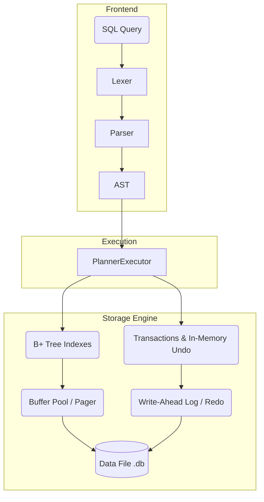

# minidb

> A lightweight, educational, yet fully functional SQL database engine written entirely in pure Python.
> Featuring a B+ tree storage layer, Write-Ahead Logging (WAL) for durability, ACID transactions, and a custom recursive-descent SQL parser—with **zero third-party dependencies**.

[](https://github.com/Luv-Goel/minidb/actions/workflows/ci.yml)
[](https://Luv-Goel.github.io/minidb/)


`minidb` is not a wrapper around SQLite or any other existing engine. The entire database stack—from the lexical analysis of SQL queries to the physical persistence of bytes on a disk—is built from scratch in this repository. It spans roughly two thousand lines of highly readable, extensively tested Python code, making it a perfect reference for understanding how relational databases work under the hood.

---

## 📖 Table of Contents
- [Architecture & Design](#architecture--design)
- [Feature Matrix](#feature-matrix)
- [Getting Started](#getting-started)
- [Interactive Shell (REPL)](#interactive-shell-repl)
- [Using as a Python Library](#using-as-a-python-library)
- [Deep Dive: How it Works](#deep-dive-how-it-works)
- [Development & Testing](#development--testing)
- [License](#license)

---

## 🏗️ Architecture & Design

The engine is decoupled into clear, modular layers that mirror industrial-grade relational database management systems (RDBMS).



### Components overview:
1. **Frontend (Lexer & Parser):** A hand-written recursive descent parser converts SQL strings into strongly typed Abstract Syntax Trees (AST).
2. **Execution Engine:** Evaluates AST nodes, pushing down selections (where clauses) to reduce memory overhead and performing streaming aggregations and joins.
3. **Storage (B+ Tree & Pager):** Data is organized into 4 KiB pages and stored in a B+ Tree, caching active pages in an LRU buffer pool.
4. **Durability (WAL):** Employs Write-Ahead Logging to guarantee atomicity and durability (fsync-on-commit), allowing full replay and crash recovery.

---

## 🚀 Feature Matrix

| Subsystem | Capabilities |
|---|---|
| **Storage & Buffer** | 4 KiB paged data file, LRU buffer pool (stealing dirty pages), dynamic free-page list recycling. |
| **Indexing** | B+ tree per table (rowid-keyed) with internal splits, linked leaves, and lazy deletes (stale separators act as routing hints). |
| **Durability (ACID)** | Redo-only WAL, strictly enforced `fsync`-on-commit, checkpointing, and **simulated crash recovery replay**. |
| **Transactions** | Explicit `BEGIN`, `COMMIT`, and `ROLLBACK` commands backed by in-memory undo buffers. |
| **DDL (Schema)** | `CREATE TABLE` and `DROP TABLE` (with `IF [NOT] EXISTS`), schema persistence, and strongly typed columns (`INTEGER`, `TEXT`). |
| **DML (Data)** | Multi-row `INSERT`, `UPDATE`, and `DELETE` execution with arbitrary `WHERE` conditions. |
| **Queries (DQL)** | `JOIN ... ON`, `WHERE` (AND/OR/NOT, `IN`, `BETWEEN`, `LIKE`, `IS NULL`), `GROUP BY` + `HAVING`, `ORDER BY`, `LIMIT`/`OFFSET`, `DISTINCT`, and aliases. |
| **Aggregates** | Built-in streaming aggregates: `COUNT`, `SUM`, `AVG`, `MIN`, `MAX`. |
| **Scalar Functions** | `upper`, `lower`, `length`, `abs`, `coalesce`, `round`, `trim`, `ltrim`, `rtrim`, `concat`, `random`. |
| **Introspection** | Prepend `EXPLAIN` to any query to view its parsed execution plan tree. |

---

## 🏁 Getting Started

Because `minidb` has zero dependencies, getting it running takes seconds.

### Prerequisites
* Python 3.10 or higher.

### Installation

```bash
git clone git@github.com:Luv-Goel/minidb.git
cd minidb
```

---

## 💻 Interactive Shell (REPL)

The repository comes with a built-in interactive shell, similar to the `sqlite3` or `psql` command-line interfaces.

```bash
# Launch the shell against a new or existing database file
python -m minidb.repl demo.db
```

### Example Session

```sql
minidb> CREATE TABLE users (id INTEGER, name TEXT, age INTEGER);
ok, 0 row(s)

minidb> INSERT INTO users VALUES (1, 'ada', 36), (2, 'grace', 85);
ok, 2 row(s)

minidb> SELECT name, round(age / 10.0, 1) as decade FROM users WHERE age >= 50;
name  | decade
------+-------
grace | 8.5
1 row(s)

minidb> EXPLAIN SELECT * FROM users;
plan
--------------------------------------
Select(columns=[SelectItem(expr=Column(name='*', table=None), alias=None)],
       from_table=TableRef(name='users', alias=None),
       ...)
```

You can also run the scripted tour to see joins and aggregations in action:
```bash
python examples/demo.py
```

---

## 📦 Using as a Python Library

You can import and use `minidb` directly in your Python applications using the context manager API.

```python
from minidb import Database

with Database("shop.db") as db:
    # 1. Create a table
    db.execute("CREATE TABLE items (sku INTEGER, label TEXT, cents INTEGER)")
    db.execute("INSERT INTO items VALUES (1, 'espresso', 350)")

    # 2. Transaction controls
    db.execute("BEGIN")
    db.execute("UPDATE items SET cents = cents + 50 WHERE sku = 1")
    db.execute("ROLLBACK") # The update is safely discarded

    # 3. Querying data
    result = db.execute("SELECT label FROM items WHERE cents < 400")
    
    for row in result:
        print(row) # Output: ('espresso',)
```

---

## 🧠 Deep Dive: How it Works

### Commit Path (Durability)
When a transaction commits, `minidb` appends redo records to the Write-Ahead Log (WAL) and issues an `fsync` to guarantee the bytes are physically written to the storage drive. Only then are the dirty pages flushed from the buffer pool to the actual `.db` file, and finally, the WAL is truncated. 

### Crash Recovery
On database startup, `minidb` checks the WAL. If it contains data, it means the database was improperly shut down (e.g., power loss). The engine replays the committed transactions identically, safely reapplying them to the data file. The records carry absolute "after-images", making the replay completely idempotent.

### B+ Tree Internals
The B+ tree enforces lazy deletion. Rather than eagerly rebalancing the tree when rows are removed (which is expensive), stale separators are left behind to act as routing hints. This is the exact same architectural trade-off made by production engines like InnoDB.

---

## 🛠️ Development & Testing

The test suite contains 48 rigorous tests covering parsing, semantic queries, B+ tree manipulation, and most notably, **simulated power-loss recovery**. 

To run the unit tests:
```bash
python -m unittest discover -s tests -v
```

During crash recovery tests, the process state is intentionally wiped, dirty pages are discarded, and the WAL is the only surviving state used to resurrect the database.

See [CONTRIBUTING.md](CONTRIBUTING.md) for more details on submitting PRs.

---

## 📄 License

This project is licensed under the MIT License - see the [LICENSE](LICENSE) file for details.
