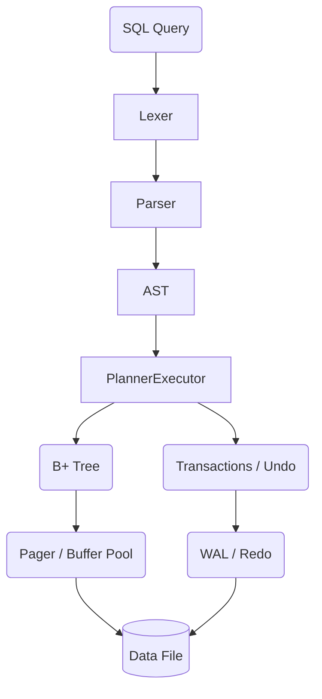

# minidb

> A small but **real** SQL database engine: pager + B+ tree storage,
> write-ahead logging, transactions, and a hand-written SQL frontend.
> Pure Python, zero dependencies.

[](https://github.com/Luv-Goel/minidb/actions/workflows/ci.yml)
[](https://Luv-Goel.github.io/minidb/)


Not a wrapper around SQLite - the storage engine, the B+ balancer, the WAL
recovery, the parser, the planner and the executor are all in this repo,
totalling a couple thousand lines of readable Python.

## Architecture



## Feature matrix

| Layer | What works |
|---|---|
| **Storage** | 4 KiB paged file, LRU buffer pool with dirty-page tracking, free-page list |
| **Indices** | B+ tree per table (rowid-keyed): splits, linked leaves, lazy deletes |
| **Durability** | redo WAL, fsync-on-commit, checkpoint, **crash recovery replay** |
| **Transactions** | `BEGIN` / `COMMIT` / `ROLLBACK` with in-memory undo |
| **DDL** | `CREATE TABLE` / `DROP TABLE` (`IF [NOT] EXISTS`), typed columns |
| **DML** | multi-row `INSERT`, `UPDATE`, `DELETE` with arbitrary `WHERE` |
| **Queries** | `JOIN ... ON`, `WHERE` (AND/OR/NOT, `IN`, `BETWEEN`, `LIKE`, `IS NULL`), `GROUP BY` + `HAVING`, aggregates (`COUNT/SUM/AVG/MIN/MAX`), `ORDER BY`, `LIMIT`/`OFFSET`, `DISTINCT`, aliases |
| **Functions** | `upper`, `lower`, `length`, `abs`, `coalesce`, `round`, `trim`, `ltrim`, `rtrim`, `concat`, `random` |
| **Introspection** | `EXPLAIN` keyword to show AST plan |
| **Shell** | interactive `python -m minidb.repl` with ASCII tables |

## Quick Start

```bash
git clone https://github.com/Luv-Goel/minidb.git
cd minidb
python -m minidb.repl demo.db
```

### Example Session

```sql
minidb> CREATE TABLE users (id INTEGER, name TEXT, age INTEGER);
ok, 0 row(s)

minidb> INSERT INTO users VALUES (1, 'ada', 36), (2, 'grace', 85);
ok, 2 row(s)

minidb> SELECT name, round(age / 10.0, 1) as decade FROM users WHERE age >= 50;
name  | decade
------+-------
grace | 8.5
1 row(s)

minidb> EXPLAIN SELECT * FROM users;
plan
--------------------------------------
Select(columns=[SelectItem(expr=Column(name='*', table=None), alias=None)],
       from_table=TableRef(name='users', alias=None),
       ...
```

## Contributing

See [CONTRIBUTING.md](CONTRIBUTING.md) for details on how to set up your dev environment and run tests.

## License

MIT - see [LICENSE](LICENSE).
