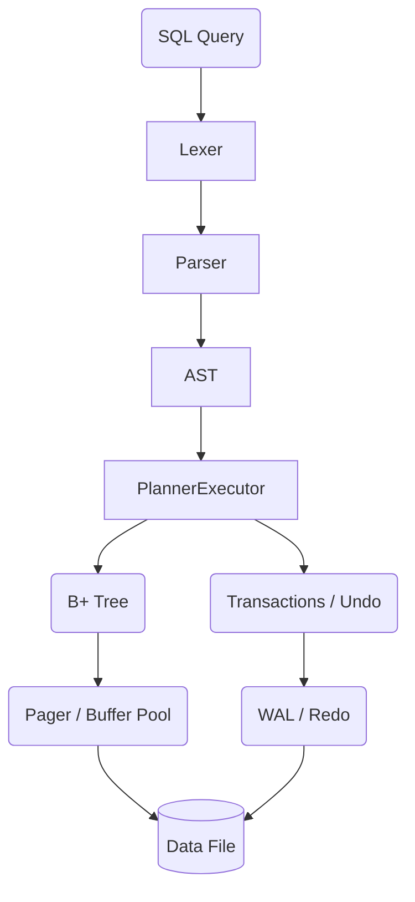

# Architecture

minidb is designed to be a readable but authentic implementation of a relational database engine.

### Components
1. **Parser & Lexer**: Converts raw SQL string to an AST.
2. **Engine**: Traverses the AST. Evaluates expressions and handles push-down filtering.
3. **B+ Tree**: The core index structure.
4. **Pager**: Manages 4KiB pages in a buffer pool.
5. **WAL**: Write-ahead-log ensuring durability and crash recovery.
